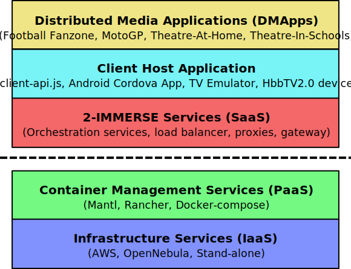

# 2-IMMERSE Getting Started

<em>This project was originally developed as part of the <a href="https://2immerse.eu/">2-IMMERSE</a> project, co-funded by the European Commission’s <a hef="http://ec.europa.eu/programmes/horizon2020/">Horizon 2020</a> Research Programme</em>

# Introduction

2-IMMERSE is an innovation project co-funded by the European Union’s Horizon 2020 research and innovation programme. It has developed a new open-source platform for object-based multiscreen entertainment. The open-source platform is based on reusable components that will accelerate the development of new immersive multi-screen experiences, encourage the take-up of the HbbTV 2.0 specification and contribute towards its evolution.

Customisable multi-screen experiences run in an ‘any device environment’ using broadcast and broadband delivered content and object-based production techniques to enhance audience interaction.

Programme exemplars based on high-value content forms including; MotoGP, the Emirates FA Cup final and award winning theatre productions, were created to define and
demonstrate the core platform capabilities.

See <https://2immerse.eu>.

# Directory structure:

* `build`
  Instructions for building 2-IMMERSE components from source.
* `deployment`
  Instructions and scripts for deploying a 2-IMMERSE platform instance.
* `examples`
  Example platform applications.
* `docs`
  Documentation and images.

# Overview

The 2-IMMERSE Object-based Broadcasting Platform enables TV programming to be customised to suit the capabilities of available client devices and network bandwidth.
Content can be adapted for a range of different environments allowing, for example, the presentation of football in a public fan-zone space to be quite different to the
presentation in a home.

Object-based broadcasting is enabled through a Distributed Media Application (DMApp), a set of software components orchestrated across the participating devices by a cloud
service platform. The DMApp components typically render media, support user interaction and/or implement application logic.

The common client software environment we have adopted to support this is HTML/CSS/JavaScript, and in particular HbbTV 2.0. The service platform we use is a
containerised platform which can be deployed using any container orchestration system such as Kubernetes, Rancher or Docker-Compose.

# Software Stack

The following diagram gives a high-level overview of the 2-IMMERSE software stack:

 

We have tested the 2-IMMERSE software with a number of PaaS and IaaS providers during development, including stand-alone setups that run locally without an internet connection. 

# Architecture

TODO: Link / reference to documentation in 2-IMMERSE/docs 

# Building

The [build](build/README.md) directory contains instructions for building the 2-IMMERSE software, together with some useful build scripts to automate the process.

# Deployment

Deployment scripts are available [here](deployment/README.md) to spin-up a locally hosted, pre-configured instance of the 2-IMMERSE platform using [Docker Compose](https://docs.docker.com/compose/). This is required in order to try out the [examples](examples/README.md). Follow the instructions for building the 2-IMMERSE software first.

# Examples

A number of example DMApps are provided in the examples subdirectory and organised into an electronic programme guide (EPG) configuration file. See the [examples documentation](examples/README.md) for how to run the samples. Follow the instructions for building and deploying and instance of the 2-IMMERSE platform first.

# Licence and Authors

All code and documentation is licensed by the original author and contributors under the Apache License v2.0:

* [British Broadcasting Corporation](http://www.bbc.co.uk/rd) (original author)

See AUTHORS.md file for a full list of individuals and organisations that have
contributed to this code.

## Contributing

If you wish to contribute to this project, please get in touch with the authors.