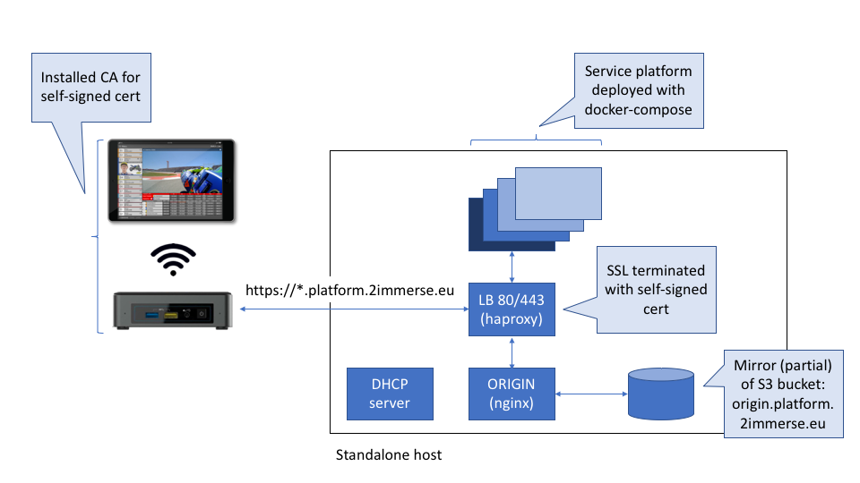

# Standalone Platform Host

## Overview

This page describes the steps necessary to deploy a standalone version of the platform that, for example, allows users to demonstrate 2Immerse DMApps without requiring a working internet connection to a cloud hosted deployment of the platform.

The approach here has been to have a standalone host that emulates the platform, with minimal changes to the client devices that connects to it.



## Instructions (Ubuntu)

### Setup

These instruction assume you have a clean install of Ubuntu >= 16.04

1. Set up a local copy of your origin content

 > Note that file permissions can be problematic for nginx to serve this content; you will likely need to change the served file permissions as follows:
 >
 >```bash shell
 >sudo chmod -R 0755 path/to/origin/content
 >```

2. install docker community edition per instructions / downloads at https://docs.docker.com/install/linux/docker-ce/ubuntu/

 > Note that you need to install docker-compose seperately afterwards:
 >
 >```bash shell
 >sudo apt install docker-compose
 >```

3. Configure the machine to use a fixed IP address on its ethernet port (easiest using network manager applet on desktop...)

 > For this example we will use 192.168.1.1

4. Configure DHCP and DNS using dnsmasq

 make sure /etc/dnsmasq.conf has the following lines:

 ```sh
 address=/YOUR_DOMAIN/192.168.1.1
 
 listen-address=127.0.0.1
 
 listen-address=192.168.1.1
 
 dhcp-range=eno1,192.168.1.50,192.168.1.150,12h
 ```
 
 > change your `IP addresses` and `YOUR_DOMAIN` as appropriate
 
 And restart dnsmasq:
 
 ```bash shell
 sudo /etc/init.d/dnsmasq restart
 ```

5. Clone this repo (or download a zipped version) onto the host

6. Make the following configuration changes:

  1. Replace all instances of `HOST_IP` in the ***haproxy/haproxy.cfg*** file with the host IP address used in step 3 above (e.g. 192.168.1.1)
  2. Replace all instances of `YOUR_DOMAIN` in the ***haproxy/haproxy.cfg*** file with the domain name used in step 3 above
  3. Go into the ***docker-compose-standalone.yml*** file and change the volume configuiration for the origin service to point to where your origin data is located `(instead of /media/...)`


7. Deploy the platform services by running:

 ```bash shell
 sudo docker-compose -f docker-compose-standalone.yml up -d
      ```

 > The `-d` flag here runs detached; without it you will drown in logs! If you need to see logs consider using:
 >
 >```bash shell
 >sudo docker-compose -f docker-compose-standalone.yml logs -f 
 >```

 you can ctrl-c out without taking down the services.    

 > optionally filter by a specific service:
 >
 >``` bash shell
 >sudo docker-compose -f docker-compose-standalone.yml logs -f layout
 >```
 
 You will see any port clashes reported here, so fix them as required:
 
   * If you have port clashes with any of the docker services in the ***docker-compose-standalone.yml*** file you will either need to disable the service already using that port, or, use a different port in docker-compose.
 > This shouldn't be the case on a clean Ubuntu install
 
   * If you change any of the port assignments, you will also need to change the corresponding port in the ***haproxy/haproxy.cfg*** file.
 > note that haproxy is expecting to run on ports 80 & 443... and you can't move these (you will need to shift or disable anything already using those ports)
 
 and when you are finished:
 
 ```bash shell
 sudo docker-compose -f docker-compose-standalone.yml down
 ```
 
 > At this point you should no longer need to have an internet connection and can run standalone from here on out...

  
8. Install browser root CA certificate on clients and configure to trust (or make sure you are running NUC firmware & using companion apps with them pre-configured)

   > See notes below for desktop Chrome installation
   >
   > You shouldn't need to install a cert on Android compaion devices.

9. If you are going to use your computer as a WiFi hotspot, you will need to configure that now

   * You can use Ubuntu's network settings from the desktop GUI
   * You can do it manually using hostapd:
   > You will probably want to disable the NetworkManager so it doesn't change any settings while you are running
   > 
   > You will need to adjust the `dnsmasq` settings to reflect the fact that you are using the wifi adapter (replace `eno1` with your wifi adapter), and make sure that you set the same IP you chose before as the IP of the wifi adapter.

### Run

At this point you should be able to run everthing from a 'cold start':

1. Power cycle the standalone host
2. Open a terminal (ctrl-alt-t), check that dnsmasq is up:

   ``` bash shell
   sudo /etc/init.d/dnsmasq status
   ```

   > Note that `dnsmasq` will almost certainly not be running if the ethernet interface is down, which will require it to be connected to either a switch or the client NUC.
  
   `dnsmasq` must be running before you start the services (next step). If you discover afterward that dnsmasq is not running, you will need to bring the services down and bring them up again for everything to work...

    If you need to restart dnsmasq:

    ```bash shell
    sudo /etc/init.d/dnsmasq restart
    ```

3. start services

   `cd` to your 'standalone' folder and run:

   ```bash shell
   docker-compose -f docker-compose-standalone.yml up -d
   ```

   You can use the provided ***health.sh*** script to see the health status of running services. You will see the services come up one by one, where services that have not yet come up will give off an error message.
   > The script looks for the ***docker-compose-standalone.yml*** file to extract the list of the services to be monitored and assumes you have `jq` installed.

4. Power up the client NUC(s)

   with the self signed cert installed it should load the onboarding screens (if using the `andoird-unified-launcher`)


### Optional

It can be useful to have a copy of Chromium installed, to allow access to Chrome DevTools on the client NUC, setting up users, using the companion emulatior launcher etc...

```bash shell
sudo apt install chromium-browser
```

You then may want to install the self-signed cert root CA to access the hosted https urls. To do this:

* Go to `chrome://settings` in the address bar
  > Menu > Advanced > Privacy & Security > Manage certificates > Trusted Root Certificate Authorities > Import
* Select your CA pem file

If you are running Chrome as a client browser on the standalone platform host, then you may be able to take advantge of this Chrome flag to avoid the need to install the self-signed certificate
> chrome://flags/#allow-insecure-localhost

Note:
> Client browsers (HbbTV Emulator and Companion Apps) need to install & change settings to trust the self-signed cert (in fact the root CA certificate for our self-signed cert)

> Services (in particular layout and editor) which implement https clients (e.g. for loading documents) also need to have the self-signed cert installed, or have TLS enforcement relaxed for this deployment


This should remove subsequent insecure warnings.


## Instructions (Mac)

The approach to running on a Mac is pretty much identical; what will differ is the DHCP server set up. OSx has one (it gets used for internet connection sharing for example). 
More details on this here: https://www.swissns.ch/site/2014/05/running-mac-os-xs-built-in-dhcp-server/
You may have stop Apache which may will already running on port 80.

## Troubleshooting

* You may find, that on occasion, a service will not have come up correctly. If this happens, you can run:

  ```bash shel
  docker-compose -f docker-compose-standalone.yml logs -f {service name}
  ```

  and see if the service is reporting any specific issues

  These would typically be fixed by running:
  
  ```bash shell
  docker-compose -f docker-compose-standalone.yml restart {service name}
  ```
  
  otherwise you can run:
  
  ```bash shell
  docker-compose -f docker-compose-standalone.yml down
  docker-compose -f docker-compose-standalone.yml up -d
  ```
  
  to restart all of the services.

* In general if you are seeing problems with a running experience, use the Chrome DevTools to inspect what is happening on the NUC:

  > http://{NUC IP address}:9223

  If you are getting 403's on origin urls, check that:
  * the origin service is up
  * the volume specified in the docker-compose file reflects the location of the actual content
  * The file permissions are correct (755 should work)

* If you see the error **EAI_AGAIN** being reported by node.js based services, such as layout or provider, then there is likely a DNS problem
  > check that dnsmasq is running OK, then bring the services down and bring them up again...


## Hardware spec

This standalone build has been tested using Intel NUC 7i3BNK devices and we were able to run all of our demo experiences with no issues.

## Known Issues

With this setup there is an issue with the editor not being able to connect to the preview player which we are addressing...

## Useful links

Creating self-signed certs: https://deliciousbrains.com/ssl-certificate-authority-for-local-https-development/